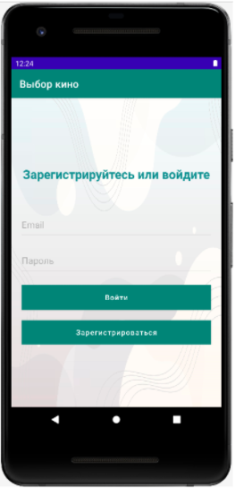
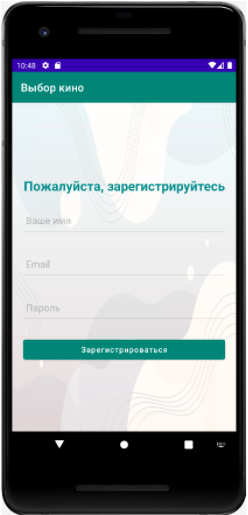
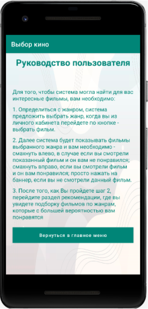
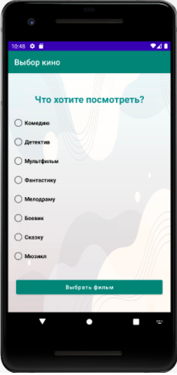
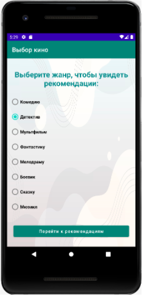

Приложение включает в себя 7 страниц: приветствие/авторизация, регистрацию, личный кабинет, руководство пользователя, 
рекомендации, страница выбора жанра и страница показывающая баннеры фильмов 

Для работы приложения прежде всего необходимо было осуществить регистрацию и авторизацию пользователей. 
Авторизацию было решено совместить с приветственным окном для удобства пользователя, таким образом при входе 
в приложение человеку предлагается либо пройти авторизацию, либо регистрацию

В случае, если пользователь не имеет учетной записи, он переходит на страницу “Регистрация”, где ему предложено будет ввести свое имя, email и пароль.

За регистрацию в классе “Registration” отвечает защищенный метод - register и встроенный метод Firebase - createUserWithEmailAndPassword, 
который обращается к облачному серверу.
После успешной регистрации пользователь вновь попадает на приветственную страницу,
где ему предлагается войти в личный кабинет. На этой странице вводится email и пароль.
За авторизацию в приложении отвечает метод - login, который обращается к облачному серверу.
После прохождения авторизации пользователь попадает в личный кабинет, где он сможет перейти к руководству пользователя,  
увидеть свои старые рекомендации (если он ранее уже использовал приложение), начать выбор жанра или же выйти из личного кабинета. 

Прежде чем приступить к следующей части приложения - Выбор жанра и фильма, 
необходимо рассказать пользователям, как работать с приложением. Эту функцию несет страница - Руководство пользователя: 

На следующем шаге пользователю предлагается сначала выбрать жанр, затем он можем приступить к выбору фильма. 

При выборе жанра выбирается определенная Activity, которая выводит данные из базы данных по заданной теме при помощи метода - getfilmJanre.
Для чтения данных из  базы данных в работе используется экземпляр DatabaseReference, метод addChildEventListener и прослушиватель ChildEventListener. 
Для захода в дочерние узлы базы данных используется child с указанием пути, 
например - .child("Films").child("Comedy") - передает путь - ссылка на базу данных/таблица Films/дочерний элемент Comedy. 
Уже оттуда можно перейти к чтению данных по уникальному номеру getKey() и выбрать необходимую информацию, например, имя snapshot.child("name").getValue().toString(). 
Прослушиватель ChildEventListener получает snapshot, так называемый моментальный снимок, который содержит данные в определенном месте базы данных на момент вызова.
После получения информации из базы данных, программа формирует визуальную картинку на основе файла cardview.xml. 
Запрошенное name передается в TextView, image в ImageView.
Для отображения картинок в приложении используется библиотека Glide.
Для создания эффекта “убирания карточек” была подключена библиотека Swipecards:library:1.0.9..

Как только пользователь делает выбор - смотрел и понравилось (отводит картинку вправо), 
смотрел и не понравилось (отводит картинку влево), не смотрел - происходит запись в базу данных

Для показа фильмов система выполняет методы getClientId и  Recommendation. Первый метод находит авторизованного пользователя и перебирает и передает уникальные id фильмов из дочерней папки recommend в Recommendation. Последний метод по ключу находит фильм в таблице “Films” в дочерней папке с выбранным жанром и передает в массив данные  - name, desc и image.
В пользовательском интерфейсе также реализована прокрутка рекомендованных фильмов при помощи NestedScrollView и выход по нажатию на предыдущую страницу выбора жанров.

Для проекта была создана Realtime Database, она позволяет обновлять данные пользователя в режиме реального времени, и настроены правила работы. 
В проекте задействовано две таблицы:
Users - таблица содержит в себе полную информацию о пользователе, а именно его имя, email, пароль, хранит информацию о рекомендациях, понравившихся, не понравившихся и не просмотренных фильмах
Films - таблица содержит перечень жанров, которые включают в себя фильмы с названиями, постерами, кратким описанием, информацию о пользователях (UId), кому понравился фильм, кому нет, а кто не смотрел, а также рекомендации к данной картине

.png "Структура таблицы Firebase")
